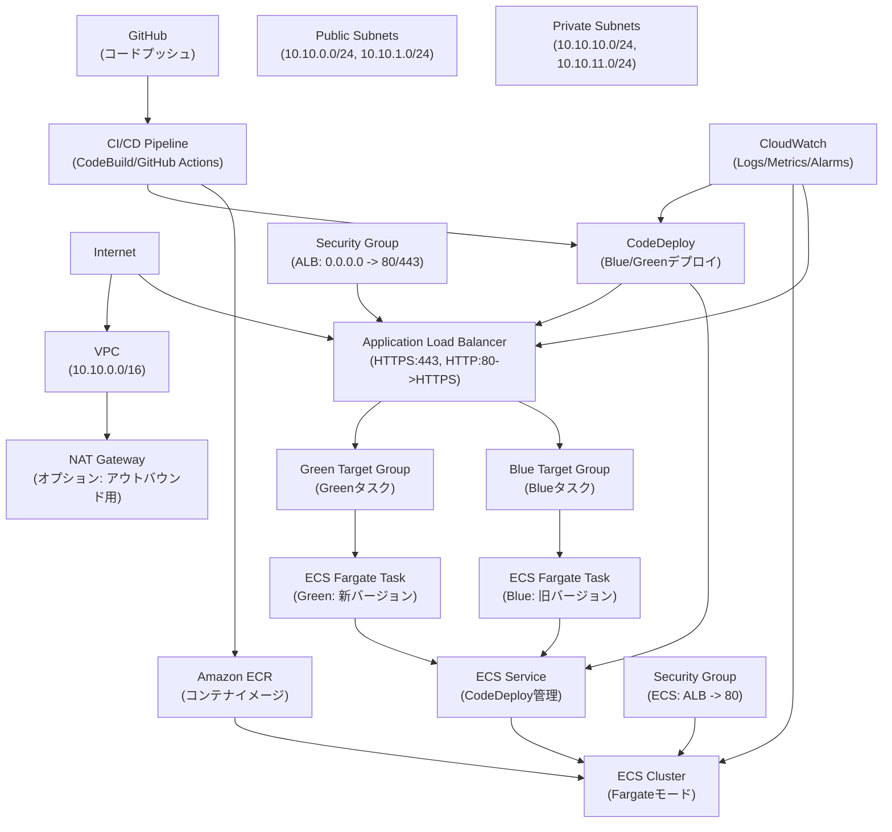

# AWS 構成図（Mermaid 記法）

以下のMermaid記法でAWSアーキテクチャの構成図を表現しています。GitHubやMarkdown対応エディタでプレビューできます。

## 説明
- **フローの流れ**: インターネット → ALB → ECSタスク (Blue/Green) → コンテナアプリ
- **Blue/Greenデプロイ**: CodeDeployがトラフィックをBlueからGreenへシフトし、問題なければBlueを停止
- **ネットワーク**: VPC内でパブリック/プライベートサブネットを分離し、セキュリティグループでアクセス制御
- **監視**: CloudWatchでALB/ECSのメトリクスとログを収集

この図を基に、実際のAWSリソースを構築していきます。Mermaid記法のため、GitHub上で直接プレビュー可能です。

## プレビューTips
- **GitHubで表示されない場合**: GitHubのMarkdownプレビューでMermaidが自動レンダリングされないことがあります。ブラウザの拡張機能（例: "Mermaid Preview"）をインストールするか、VS Codeなどのエディタでプレビューしてください。
- **代替フォーマット**: 必要に応じて、PlantUMLやASCIIアートに変換できます。プレビューが安定しない場合はお知らせください。
