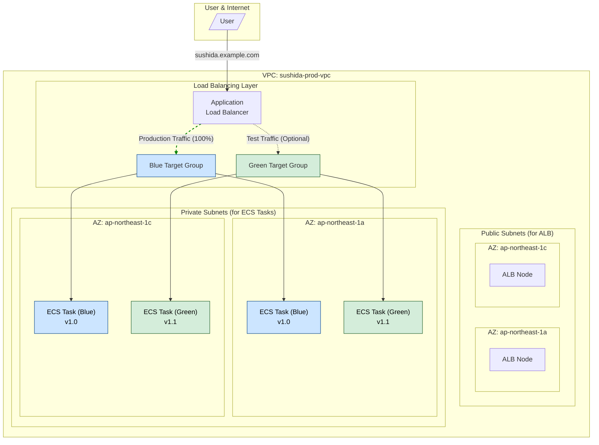

# AWS VPC ネットワーク構成図 (Blue/Greenデプロイ時)

以下は、Blue/Greenデプロイ実行中におけるAWSのネットワークとアプリケーションの構成図です。

```mermaid
graph TD
    subgraph "User & Internet"
        User[/"User"/]
    end

    subgraph "VPC: sushida-prod-vpc"
        
        subgraph "Public Subnets (for ALB)"
            direction LR
            subgraph "AZ: ap-northeast-1a"
                ALB_NodeA["ALB Node"]
            end
            subgraph "AZ: ap-northeast-1c"
                ALB_NodeB["ALB Node"]
            end
        end

        subgraph "Private Subnets (for ECS Tasks)"
            direction LR
            subgraph "AZ: ap-northeast-1a"
                ECS_TaskA_Blue["ECS Task (Blue)<br>v1.0"]
                ECS_TaskA_Green["ECS Task (Green)<br>v1.1"]
            end
            subgraph "AZ: ap-northeast-1c"
                ECS_TaskB_Blue["ECS Task (Blue)<br>v1.0"]
                ECS_TaskB_Green["ECS Task (Green)<br>v1.1"]
            end
        end

        subgraph "Load Balancing Layer"
            ALB["Application<br>Load Balancer"]
            BlueTG["Blue Target Group"]
            GreenTG["Green Target Group"]
        end
    end

    %% --- Style Definitions ---
    style BlueTG fill:#cce5ff,stroke:#004085
    style GreenTG fill:#d4edda,stroke:#155724
    style ECS_TaskA_Blue fill:#cce5ff,stroke:#004085,color:#000
    style ECS_TaskB_Blue fill:#cce5ff,stroke:#004085,color:#000
    style ECS_TaskA_Green fill:#d4edda,stroke:#155724,color:#000
    style ECS_TaskB_Green fill:#d4edda,stroke:#155724,color:#000

    %% --- Connections ---
    User -- "sushida.example.com" --> ALB
    
    ALB -- "Production Traffic (100%)" --> BlueTG
    ALB -. "Test Traffic (Optional)" .-> GreenTG

    BlueTG --> ECS_TaskA_Blue
    BlueTG --> ECS_TaskB_Blue

    GreenTG --> ECS_TaskA_Green
    GreenTG --> ECS_TaskB_Green
    
    linkStyle 1 stroke:green,stroke-width:2px,stroke-dasharray: 5 5;
```
