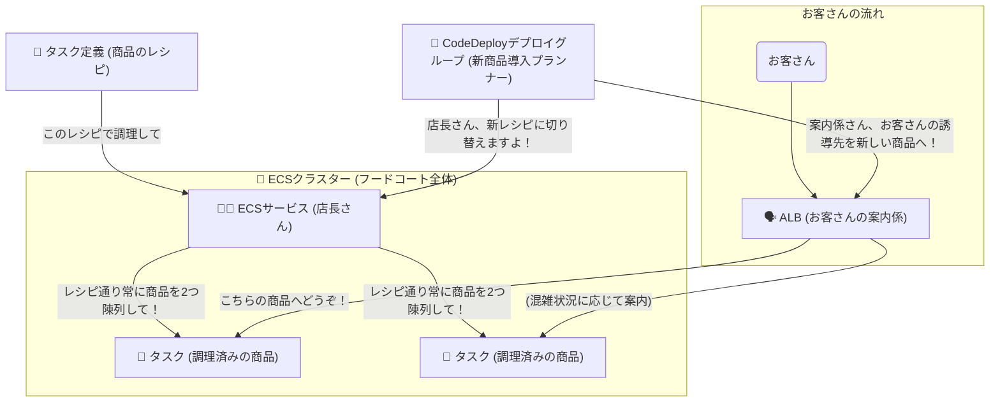

# ECSとCodeDeployの概念図と解説（フードコートの例え）

## 全体像の図（Mermaid）

---

## 各要素の解説

#### 1. 🏢 ECSクラスター (フードコート全体)
*   **例え**: たくさんの厨房と販売スペースがある、巨大でハイテクなフードコートです。
*   **解説**: EC2（仮想サーバー）やFargate（サーバーレス）といった、プログラムを動かすためのコンピューターパワーが集まっている大きな「場所」です。これから作るお店（サービス）は、すべてこのフードコートの中に出店します。

#### 2. 📝 タスク定義 (商品のレシピ)
*   **例え**: 唐揚げ弁当の「レシピ」です。
*   **解説**: コンテナを起動するための設計図です。「どのDockerイメージ（食材）を使うか」「どれくらいのCPUとメモリ（火力と調理スペース）が必要か」「どのポート（提供口）を開けるか」といった情報がすべて書かれています。このレシピさえあれば、誰でも同じ品質の唐揚げ弁当を作れます。

#### 3. 🍱 タスク (調理済みの商品)
*   **例え**: レシピ通りに作られて、店頭に並んでいる「唐揚げ弁当そのもの」です。
*   **解説**: 「タスク定義（レシピ）」を元にして、実際に起動しているコンテナのことです。お客さん（ユーザー）は、このタスクにアクセスしてアプリケーションを利用します。

#### 4. 👨‍🍳 ECSサービス (店長さん)
*   **例え**: お店の「店長さん」です。
*   **解説**: 店長の仕事は、「**常に指定された数の商品を店頭に並べておくこと**」です。
    *   「唐揚げ弁当（タスク）を常に2つ陳列しておいてください」と指示すれば、店長さんは常に2つのタスクが起動している状態を保ちます。
    *   もし、お弁当が1つ売れたり（＝コンテナが何らかの理由で停止）、傷んでしまったりしたら、店長さんはすぐにレシピ（タスク定義）を見て新しいお弁当（タスク）を調理し、店頭に補充してくれます（**自己修復機能**）。
    *   また、お客さんを商品まで案内する「案内係（ALB）」との連携も店長さんの仕事です。

---

### 🚀 CodeDeployデプロイグループ (新商品導入プランナー)

さて、ここからが本題です。
唐揚げ弁当が人気なので、新しく「生姜焼き弁当」を売り出すことになりました。でも、唐揚げ弁当を売っているお店を一度閉めて、内装工事をするわけにはいきません。お客さんがいるからです。

そこで登場するのが、**新商品導入プランナー (CodeDeployデプロイグループ)** です。

*   **例え**: お店を閉めずに、新商品を安全に入れ替えるための専門家チームとその「計画書」です。
*   **解説**: Blue/Greenデプロイという手法を使って、安全にアプリケーションを更新するための設定の集まりです。

#### プランナーの仕事 (Blue/Greenデプロイの流れ)

1.  **新しい厨房を準備 (Greenの起動)**
    プランナーは、唐揚げ弁当（古いバージョン＝**Blue**）を売っている厨房の隣に、**見えないように**新しい厨房（新しいバージョン＝**Green**）を準備します。そしてそこで、新しいレシピで「生姜焼き弁当」を調理し始めます。

2.  **味見と最終チェック (ヘルスチェック)**
    生姜焼き弁当がレシピ通りに美味しくできているか、プランナーは入念にチェックします。

3.  **お客さんの案内先を変更 (トラフィックの切り替え)**
    チェックOKなら、プランナーは「案内係（ALB）」に指示を出します。「これからは、お客さんを新しい生姜焼き弁当の方へ案内してください」と。案内係は、徐々に、または一気にお客さんを新しい厨房へ誘導します。

4.  **古い厨房を片付ける (Blueの停止)**
    全員が新しい生姜焼き弁当に満足していることを確認したら、プランナーは古い唐揚げ弁当の厨房を静かに片付けます。もし万が一、生姜焼き弁当が不評だったら、すぐに案内係に「やっぱり唐揚げ弁当に戻して！」と指示して、元に戻せます（**ロールバック**）。

この一連の安全な入れ替え作業の**計画書**、つまり「どのフードコートで」「どの店長さんと連携し」「どの案内係に指示を出すか」といった情報がすべて書かれているのが、**CodeDeployデプロイグループ**なのです。

### まとめ

| 要素 | フードコートでの例え | 役割 |
| :--- | :--- | :--- |
| **ECSクラスター** | 🏢 フードコート全体 | コンピューターパワーが集まる場所 |
| **タスク定義** | 📝 商品のレシピ | コンテナの設計図 |
| **タスク** | 🍱 調理済みの商品 | 実際に動いているコンテナ |
| **ECSサービス** | 👨‍🍳 店長さん | タスクの数を維持・管理する |
| **Deploy Group** | 👷 新商品導入プランナー | サービスを停止せず安全に更新する計画 |
